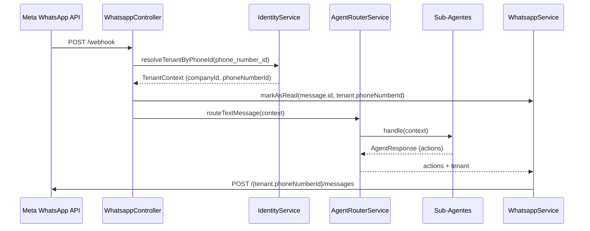
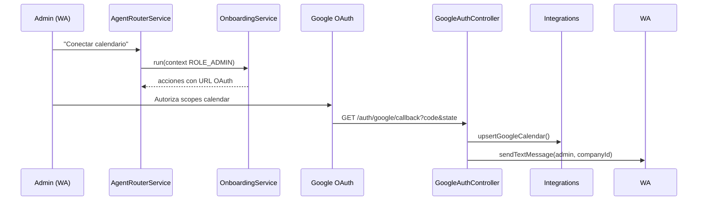
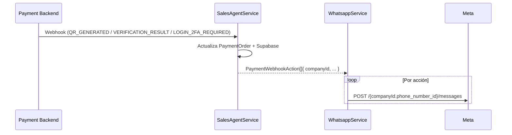

# Flujos del Programa y Casos de Prueba

Este documento describe los recorridos clave del bot, incluyendo diagramas de secuencia y pruebas sugeridas para garantizar el funcionamiento multi-tenant.

## 1. Flujo de Mensajes Entrantes por WhatsApp

**Paso a paso**

1. Meta envía el webhook con `metadata.phone_number_id` dedicado a la empresa receptora.
2. `IdentityService` resuelve el tenant usando `companies.whatsapp_phone_id` y adjunta los números administrativos (`companies.whatsapp_admin_phone_ids`).
3. `WhatsappService` marca el mensaje como leído usando el mismo número del tenant (no importa lo que haya en `.env`).
4. `IdentityService.resolveRole` determina si el remitente es `ROLE_ADMIN` o `ROLE_CLIENT`.
5. `AgentRouterService` ejecuta sanitización, onboarding (cuando falta OAuth) y enruta al agente correcto.
6. Si no se detecta una intención válida, el router genera una respuesta natural usando `companies.config.profile` (tono, persona, política comercial) para mantener el contexto humano.
7. Cada acción generada se despacha nuevamente usando el `phone_number_id` del tenant.

**Casos de prueba sugeridos**

- _Dueño registrado_ (`59177242197`). Debe recibir privilegios de admin e instrucciones para vincular Google si no existe integración.
- _Cliente nuevo_ (`59163020142`). Se registra como `ROLE_CLIENT` en `company_users` y solo puede acceder a flujos de venta/citas.
- _Tenant desconocido_. Enviar un webhook con `phone_number_id` inexistente debe registrarse como advertencia y descartarse sin error 5XX.
- _Cliente sin intención_. Verifica que el bot responda de forma natural (usando `companies.config`) en vez de un mensaje genérico.

## 2. Flujo de Onboarding Google Calendar (solo Admin)

**Validaciones**

- Si `company_integrations` no tiene `GOOGLE_CALENDAR`, la respuesta debe ser:
  > "Parece que no tienes una cuenta de Google asociada..."
- Tras el callback exitoso, el administrador recibe un mensaje enviado desde el número del tenant involucrado.
- Los clientes nunca ven este flujo; si intentan comandos administrativos, el router responde indicando que requieren rol administrador.

## 3. Flujo del Webhook de Pagos

**Eventos soportados**

- `QR_GENERATED`: envía texto e imagen Base64 del QR.
- `VERIFICATION_RESULT`: confirma o reinicia el flujo según `success`.
- `LOGIN_2FA_REQUIRED`: notifica al cliente y a todos los admins (`company_users` + números en `companies.whatsapp_admin_phone_ids`).

**Pruebas recomendadas**

1. Simular `QR_GENERATED` con `company_id` distinto y verificar que cada cliente recibe el mensaje desde su número dedicado.
2. Simular `LOGIN_2FA_REQUIRED` y confirmar que los administradores configurados reciben la alerta aun si no están en `company_users` (usa el array `whatsapp_admin_phone_ids` con MSISDNs).
3. Confirmar que los clientes no pueden completar el flujo `TOKEN/2FA`; el router debe bloquearlo y recordarles las capacidades disponibles.

## 4. Flujo de Warmup Bancario (Jobs Programados)

1. `PaymentWarmupService` itera todas las compañías desde Supabase.
2. Llama a `paymentClient.warmupBankSession(companyId)`.
3. Si la respuesta requiere 2FA se setea `needs_2fa_attention` y se avisa a los administradores usando `sendTextMessage(..., { companyId })`.

**Pruebas**

- Mockear un warmup que solicite 2FA y validar que el mensaje llega desde el número correspondiente.

---

Mantén estos flujos como referencia al crear nuevos casos de prueba end-to-end. Cada validación debe asegurar que el `phone_number_id` usado para llamadas a Meta coincida con el tenant resuelto y que cualquier ausencia de OAuth se comunique exclusivamente a usuarios con rol administrador.
